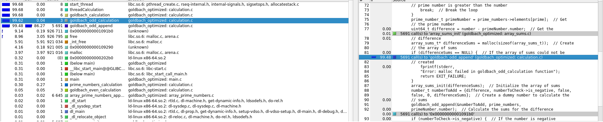
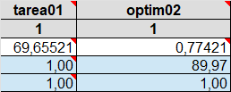
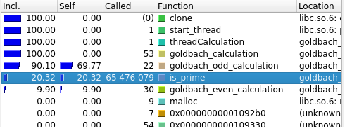
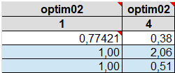
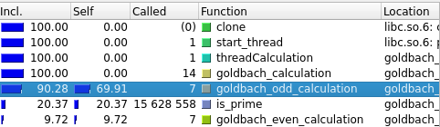
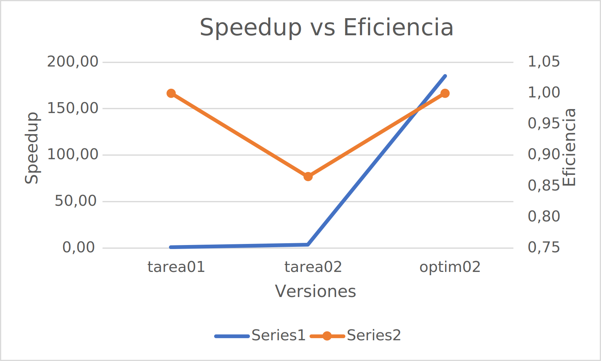
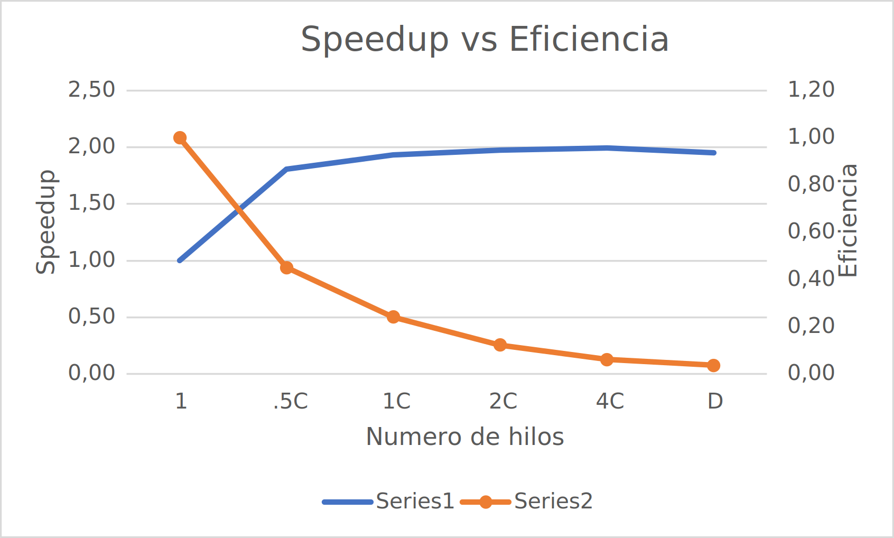

# Documento de reporte


## Optimizacion serial


### Reporte del profiling


Se adjunta el analisis realizado por callgrind: 





Al observar el reporte, se puede notar el gran consumo que proviene del calculo de las sumas impares; por lo tanto, se busca redisenar el calculo de sumas impares para que sea menos exigente computacionalmente, ademas de reducir el tiempo que utiliza el programa en ciclos.

### Diseno de la optimizacion 


Para optimizar el calculo de las sumas impares, se decidio utilizar el siguiente razonamiento: 


* Se tiene un numero impar, si la diferencia entre la suma de dos numeros primos y el numero impar es primo, entonces la suma de los dos numeros primos y la diferencia entre ellos es una suma de goldbach.


Bajo esta logica, se implento un algoritmo que, dados dos numeros primos sumados, verifica si la diferencia con el numero impar es prima, y si lo es, entonces la suma entre los dos numeros primos y la diferencia es guardada como una suma de goldbach.


El nuevo algoritmo seguira el siguiente pseudocodigo:


```
procedure goldbach_odd_calculation (var Number : 64-bit integer, var prime numbers : dynamic 64-bit unsigned integer array):
Let primeRange be Number/2
Let firstAddend be 0
Let secondAddend be 0
while firstAddend < primeRange
    Let sum be firstAddend + secondAddend
    let difference be Number - sum
    if difference is prime
        if Number is negative
            Add firstAddend to sums
            Add secondAddend to sums
            Add difference to sums
        end if
        Number.sumNumber++
    end if 
    secondAddend increased to next prime number
    if secondAddend is greater than primeRange
        firstAddend increased to next prime number
        secondAddend = firstAddend
    end if
    if firstAddend = 2 and secondAddend != 2
        firstAddend increased to next prime number
        secondAddend = firstAddend
    end if
end while
end odd_calculation
```


### Resultados de la optimizacion


Se adjunta la hoja de calculo con los resultados de la optimizacion:





Como se puede observar, la reduccion en el tiempo de ejecucion fue drastica; el tiempo de ejecucion de la version original fue de 69.65 segundos, mientras que la version optimizada solo tomo 0.77, lo que representa una reduccion de casi 90 veces en el tiempo de ejecucion. La eficiencia se mantuvo igual, ya que no se agrego ningun trabajor extra al programa, solo se redujo el tiempo de ejecucion de la suma de goldbach.


### Lecciones aprendidas


Esta optimizacion hizo notar la importancia de analizar el codigo y buscar formas de reducir el tiempo de ejecucion de las funciones mas costosas, ya que se logro reducir el tiempo de ejecucion de la suma de goldbach sin necesidad de paralelizar el programa, lo que hubiera sido mas costoso computacionalmente.


## Optimizacion paralela


### Reporte del profiling


Se adjunta el analisis realizado por callgrind:





Al observar el reporte, se quiere destacar el numero de llamadas a goldbach_calculation; un solo thread esta calculando 53 sumas al ejecutar el caso de prueba 23, lo que puede aumentar el tiempo de ejecucion del programa. Por lo tanto, se busca paralelizar el calculo de las sumas de goldbach.


### Diseno de la optimizacion


Para paralelizar el calculo de las sumas de goldbach, se decidio utilizar el siguiente razonamiento:


* Utilizando mapeo dinamico, cada thread se asigna un numero y aumenta un contador. De esta manera se puede calcular la suma de goldbach de cada numero de forma paralela.


Bajo esta logica, se implementaron metodos para crear hilos, ademas de estructuras de datos con el contador y el arreglo de numeros.


### Resultados de la optimizacion


Se adjunta la hoja de calculo con los resultados de la optimizacion:





Como se puede observar, el tiempo logro reducirse a un poco mas de la mitad del tiempo de ejecucion de la version un thread, lo que representa una reduccion de casi 2 veces en el tiempo de ejecucion. La eficiencia se redujo un 50%, ya que se aumento el numero de threads.


Un informe de callgrind con el profiling de la version paralela se adjunta: 





Este profiling corresponde a un thread de ejecucion. Se puede notar que el numero de llamadas a goldbach_calculation se redujo a 14, es decir, cada thread calcula menos sumas de goldbach, lo que reduce el tiempo de ejecucion del programa.


### Lecciones aprendidas


Esta optimizacion hizo notar la importancia de paralelizar el codigo, ya que se logro reducir el tiempo de ejecucion a coste de poco codigo adicional. Sin embargo, se debe tener cuidado con el numero de threads, ya toman recursos del sistema y pueden afectar el rendimiento del programa.


## Comparacion de optimizaciones


### Grafica de comparacion, tiempo-speedup


Se adjunta la grafica de comparacion entre las versiones finales:


 Como se puede observar, existe una gran diferencia entre el tiempo de ejecucion de la version original y la version optimizada, con la version pthread estando en el medio. Gracias a esto podemos ver que, solamente una optimizacion de algoriticmo logro reducir el tiempo de ejecucion de la suma de goldbach en casi 90 veces, mientras que la version original pthread logro reducirlo en casi 2 veces.

 Con respecto a la eficiencia del programa, se puede observar que la version optimizada es bastante eficiente, con respecto a la version original. Este comportamiento se puede observar en la grafica de speedup vs eficiencia, adjuntada a continuacion:





Al ser el punto de comparacion la version original, la version optimizada logra mucho speedup; sin embargo, la version pthread no logra tanto speedup y su eficiencia es menor. Gracias a esto, podemos inferir que la optimizacion de algoritmo realizada logro mejorar el rendimiento del programa sustancialmente; incluso mas que una paralelizacion del programa.


### Grado de concurrencia


En esta seccion nos interesa saber el grado de concurrencia necesario para alcanzar el equilibrio entre el speedup y la eficiencia. Para esto, se adjunta la grafica de speedup vs eficiencia:





Todas las comparaciones se realizaron con respecto a la version optimizada serial. En ella podemos observar que, como se esperaba, existe beneficio en paralelizar el calculo de numeros. Sin embargo, se puede observar que, a partir de 4 threads, la eficiencia del programa comienza a disminuir, gastanto mas recursos sin lograr un speedup significativamente mayor. Este comportamiento se puede explicar por el costo de crear y administrar los threads, que es mayor que el beneficio de paralelizar con tantos threads.


Por lo tanto, en el grafico se observa que, en un punto, el speedup y la eficiencia se encuentran en un equilibrio. Este punto se encuentra entre 2 y 3 threads, lo que indica que, fuera el manejo de recursos un problema; se podria lograr un speedup significativo con 2 o 3 threads, sin afectar demasiado la eficiencia del programa.

